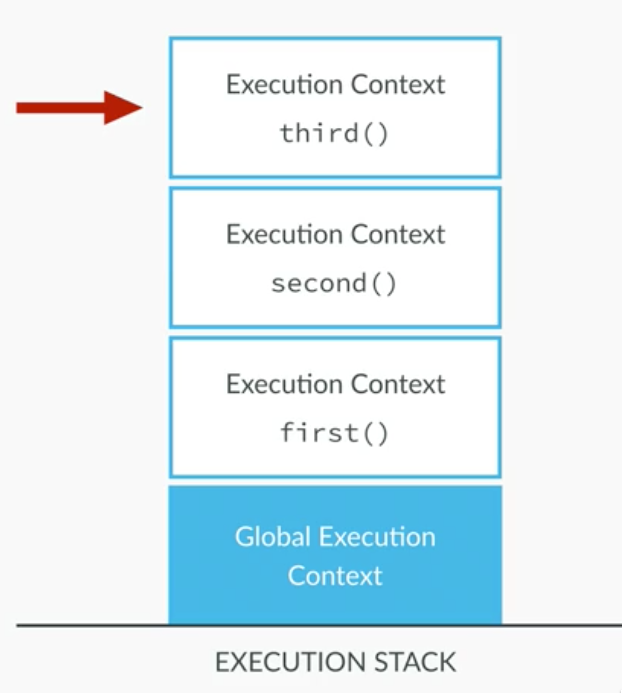

### Lecture: Functions
~~~
function calculateAge(yearOfBirth) {
    var age = 2016 - yearOfBirth;
    return age;
}

var ageJohn = calculateAge(1990);
var ageMike = calculateAge(1969);
var ageMary = calculateAge(1948);

function yearsUntilRetirement(name, year) {
    var age = calculateAge(year);
    var retirement = 65 - age;

    if (retirement >= 0) {
        console.log(name + ' retires in ' + retirement + ' years.');
    } else {
        console.log(name + ' is already retired.');
    }
}

yearsUntilRetirement('John', 1990);
yearsUntilRetirement('Mike', 1969);
yearsUntilRetirement('Mary', 1948);
~~~

### 함수가 스택에 쌓이는 구조 

~~~
var name = "John" ;

function first(){
    var a = "Hello!" ;
    second();
    var a = a + name ;
}

function second(){
    var b = "Hi!" ;
    third();
    var z = b + name ;
}

function third() {
    var c = "Hey!" ;
    var z = c + name ;
}

first() ;

// --- 결과 
// third.z: Hey! John
// second.z : Hey! John
// first.a : Hello! John
~~~

### Lecture: Statements and expressions
~~~
function someFun(par) {
    //code
}

var someFun = function(par) {
    //code
}

//Expressions
3 + 4;
var x = 3;

//statements
if (x === 5) {
    //do soemthing
}
~~~

 

----
### Lecture: Arrays
~~~
var names = ['John', 'Jane', 'Mark'];
var years = new Array(1990, 1969, 1948);

console.log(names) ;
console.log(names[2]);
names[1] = 'Ben';
console.log(names);

var john = ['John', 'Smith', 1990, 'designer', false];

john.push('blue');
john.pop();
john.shift();
john.unshift('Mr.');

console.log(john);

console.log(john.indexOf('Smith') ; // 1

if (john.indexOf('teacher') === -1) {
    console.log('John is NOT a teacher.');
}
~~~

### 배열 조작
- 배열 길이 
    - 배열.length 
    
- 배열 뒤에서 
    - push() 뒤에 추가 
    - pop() 마지막 삭제
- 배열 앞에서    
    - unshift() 배열의 첫번째 삽입
    - shift() 배열의 첫번째 삭제  
  
~~~
var john = ['John', 'Smith', 1990, 'designer', false];

john.push('blue');
john.pop();
john.shift();
john.unshift('Mr.');

console.log(john);
~~~

- join()
    -  모든 원소를 문자열로 변환하고, 이어붙임 
~~~
var a = [1,2,3] ;
var s = a.join() ; //s == "1,2,3"

console.log(s)
~~~

- sort() 
    - 배열 안의 원소를 정렬 
~~~
var a = new Array("banna", "cherry", "apple");
a.sort();
    
console.log(a) ;
~~~
    
- reverse() 
    - 배열 안의 원소를 반대로 정렬 
~~~
var a = new Array(1,2,3);
a.reverse();
    
console.log(a);
~~~
    
- concat()
    - 배열의 모든 원소를 이어 붙여 새롭게 생성 
~~~
var a = [ 1, 2, 3]
a.concat(4,5) ; // [ 1,2,3,4,5]
a.concat([4,5]) ;// [ 1,2,3,4,5]
a.concat([4,5],[6,7]) ; // [1,2,3,4,5,6,7]
a.concat([4, [5,[ 6,7]]) ; // [1,2,3,4,5,[6,7]] 
~~~
         
- slice()
    - 배열의 일부분을 반환 
~~~
var a = [ 1,2,3,4,5] ;
a.slice(0,3) ; // [1,2,3] 
a.slice(3); // [4,5]
a.slice(1,-1) ; // [ 2,3,4 ]
~~~

 
---

### 다차원 배열 
~~~
//다차원 배열 생성 
var table = new Array(10);
              
for(var i=0 ; i < table.length ; i++){
    table[i] = new Array(10);
}
 
//배열 초기화                   
for(var row =0 ; row < table.length ; row++){
    for(col = 0 ; col < table[row].length ; col++) {
        table[row][col] = row * col ;
    }
}

// 5*7 을 계산하기 위해 구구단표를 이용 
var product = table[5][7] ; 35                                  
~~~

 

---
### change 2
~~~
var years = [2001, 1985, 1994, 2014, 1973 ] ;
var ages = [] ;

for (var i= 0; i < years.length ; i++){
    ages[i] = 2016 - years[i] ;
}
    
for (var i =0  ; i < ages.length ; i++){
    if(ages[i] >= 18) {
         console.log('Person '+(i+1) + 'is ' + ages[i] + 'years old,' +
         'and is of full ages.');
     } else {
        console.log('Person '+(i+1) + 'is '+ ages[i]+ 'years old,'+
        'and is NOT of full age.');
     }
}         
~~~    

~~~
function printFullAge(years){
   //위의 소스를 복사해 넣음  
}
~~~

- 추가 사항 
~~~
function printFullAge(years){
   //위의 소스를 복사해 넣음
   var ages = []
   var fullAges= [] ; 추가   
   
    for(){
        if(){
            ...
            fullAges.push(true); //추가 
        
        } else {
            ...
            fullAges.push(false) ;; //추가 
        }
    }
    
    return fullAges ; //추가 
            
}

var full_1 = printFullAge(years)
var full_2 = printFullAge(years)
~~~
    
 

----
### Lecture: Objects

~~~
var john = {
    name: 'John',
    lastName: 'Smith',
    yearOfBirth: 1990,
    job: 'teacher',
    isMarried: false
};

console.log(john.lastName);
console.log(john['lastName']);

var xyz = 'job';
console.log(john[xyz]);

john.lastName = 'Miller';
john['job'] = 'programmer';

console.log(john);

var jane = new Object();

jane.name = 'Jane';
jane.lastName = 'Smith';
jane['yearOfBirth'] = 1969;
jane['job'] = 'retired';
jane['isMarried'] = true;

console.log(jane);
~~~

### Lecture: Objects and methods
~~~
// v1.0

var john = {
    name: 'John',
    lastName: 'Smith',
    yearOfBirth: 1990,
    job: 'teacher',
    isMarried: false,
    family: ['Jane', 'Mark', 'Bob'],
    //calculateAge : function(yearOfBirth) { return 2016 - yearOfBrith); }
    calculateAge: function() {
        return 2016 - this.yearOfBirth;
    }
};

console.log(john.family) ;
console.log(john.family[1]) ;

//console.log(john.calculateAge(1970));

console.log(john.calculateAge());

var age = john.calculateAge();
john.age = age;

console.log(john);

//v2.0

var john = {
    name: 'John',
    lastName: 'Smith',
    yearOfBirth: 1990,
    job: 'teacher',
    isMarried: false,
    family: ['Jane', 'Mark', 'Bob'],
    calculateAge: function() {
        this.age = 2016 - this.yearOfBirth;
    }
};

john.calculateAge();
console.log(john);

var mike = {
    yearOfBirth: 1950,
    calculateAge: function() {
        this.age = 2016 - this.yearOfBirth;
    }
};

mike.calculateAge();
console.log(mike);
~~~

 

---
### Lecture: Loops
~~~
for (var i = 0; i < 10; i++) {
    console.log(i);
}

//결과 
0, true, print 0, update i to 1
1, true, print 1, update i to 2
.
.
.
9, true, print 9, update i to 10
10, FALSE, end loop!

~~~

~~~
var names = ['John', 'Jane', 'Mary', 'Mark', 'Bob'];

// for loops
for (var i = 0; i < names.length; i++) {
    console.log(names[i]);
}

for (var i = names.length - 1; i >= 0; i--) {
    console.log(names[i]);
}
~~~

### while 
~~~
var i = 0;
while(i < names.length) {
    console.log(names[i]);
    i++;
}
~~~

### break and continue 
- break 
    - for 
    - while
    - switch
~~~
for (var i = 1; i <= 5; i++) {
    console.log(i);

    if (i === 3) {
        break;
    }
}

for (var i = 1; i <= 5; i++) {
    if (i === 3) {
        continue;
    }

    console.log(i);
}
~~~

### CODING CHALLENGE 2
~~~
//### change 2

/*
1. Create an array with some years where persons were born
2. Create an empty array (just [] )
3. Use a loop to fill the array with the ages of the persons
4. Use another loop to log into the console whether each person is of full age (18 or older), as well as their age

5. Finally, create a function called printFullAge which receives the array of years as an argument, executes the steps 2., 3. and 4. and returns an array of true/false boolean values: true if the person is of full age (>= 18 years) and false if not (< 18 years)
6. Call the function with two different arrays and store the results in two variables: full_1 and full_2

Example input:  [1965, 2008, 1992]
Example output: [true, false, true]

Hint: you can use a loop not only to read from an array, like y[i], but also to set values in an array, like y[i] = ... You can also use the specific array methods.
*/
~~~
~~~
function printFullAge(years) {
    var ages = [];
    var fullAges = [];

    for (var i = 0; i < years.length; i++) {
        ages[i] = 2016 - years[i];
    }

    for (i = 0; i < ages.length; i++) {
        if (ages[i] >= 18) {
            console.log('Person ' + (i + 1) + ' is ' + ages[i] + ' years old, and is of full age.');
            fullAges.push(true);
        } else {
            console.log('Person ' + (i + 1) + ' is ' + ages[i] + ' years old, and is NOT of full age.');
            fullAges.push(false);
        }
    }

    return fullAges;
}

var years = [2001, 1985, 1994, 2014, 1973];  // 처음에는 var ages=[] 선언
var full_1 = printFullAge(years);
var full_2 = printFullAge([2012, 1915, 1999]);
~~~    

### 타이머
- 2초 후 출력 
~~~
setTimeout( function(){ console.log("Hello"); }, 2000) ;
~~~

- 2초마다 출력  
~~~
setInterval( function(){ console.log("Hello"); }, 2000) ;
~~~

### Math 
- Math 
    - Math.random() 랜덤하게 가져옴 
    - Math.round(number) 반올림 
    - Math.ceil(number) 올림 
    - Math.floor(number) 버림 
~~~
function randomFunc(){
    var ran = Math.random() ;
    var round = Math.round( (ran*10)+1) ;
    var floor = Math.floor( (ran*10)+1) ;
    var ceil = Math.ceil( (ran*10)+1) ;

    console.log("random:"+ran+", round:"+round+", floor:"+floor+", ceil:"+ceil);
}
randomFunc();

//결과 
random:0.9448978899500236, round:10, floor:10, ceil:11
~~~

### Date()
- new Date()
    - new Date(년,월,일) (2008,2,1)
    - new Date(년,월,일,시,분,초) (2008,2,1,12,30,00)
- Date() 메소드 
    - getFullYear()
        - getYear() : 1900 을 기준 2017-1900 = 117 
    - getMonth() (0~11)
    - getDate() : 일 
    - getDay() : 요일 일:0,월:1
    - getTime()
    - getHours()
    - getMinutes()
    - getSeconds()   
- 설정일 경우 set이 앞에 존재                          
~~~
var today = new Date();
document.write("<h3>Document accessed on: "+today.toString());
~~~

- 오늘 날짜 시간 출력 
~~~
function getDay(day){
    var dayStr ;
    switch(day){
        case 0 :
            dayStr = "일" ;
            break ;
        case 1 :
            dayStr = "월" ;
            break ;
        case 2 :
            dayStr = "화" ;
            break ;
        case 3 :
            dayStr = "수" ;
            break ;
        case 4 :
            dayStr = "목" ;
            break ;
        case 5 :
            dayStr = "금" ;
            break ;
        case 6 :
            dayStr = "토" ;
            break ;
    }
    return dayStr
}

var today = new Date();
document.write("<h3>Document accessed on: "+today.toString());
document.write(" ") ;
document.write("오늘은 "+today.getFullYear()+"/"+(today.getMonth()+1)+"/"+today.getDate()) ;
document.write(" ") ;
document.write(getDay(today.getDay())+"요일") ;
document.write(" ") ;
document.write(today.getHours()+":"+today.getMinutes()+":"+today.getSeconds());

//결과 --- 
오늘은 2017/11/13
월요일
23:7:36
~~~

- \"오전/오후\" 시:분 으로 표시 
~~~
// 시간을 읽어와서 '오전/오후 시:분' 형태로 구해주는 함수
function getTime(){
    var now = new Date()
    var hour = now.getHours() ;
    var minute = now.getMinutes() ;
    var ampm ;

    if(hour >=12){
        hour -= 12 ;
        ampm ="오후" ;
    } else {
        ampm ="오전" ;
    }

    if(hour ==0) {
        hour = 12 ;
    }

    if(minute < 10){
        minute = "0"+minute ;
    }

    return ampm+" "+ hour+":"+minute ;
}
document.write(getTime());

//결과
오후 11:14
~~~
 
- 년월일의 마지막 날짜 
~~~
//년과 월을 받아서 마지막 일을 계산해주는 함수
function getDay(year, month){
    var lastMonth = new Array(31, 29, 31, 30, 31, 30, 31, 31, 30, 31, 30, 31) ;
    var mon2 ;
    //윤년 체크
    if(year % 4 ==0) {
        mon2 = true ;
    }
    if(year % 100 == 0) {
        mon2 = false ;
    }
    if(year % 400 == 0) {
        mon2 = true ;
    }

    if(mon2){
        lastMonth[1] = 29 ;
    } else {
        lastMonth[1] = 28 ;
    }

    return lastMonth[month] ;
}

document.write(getDay(2017,10)); //11월달 

//결과 
30 
~~~

- 달력 만들기 
    - Math 
        - Math.round(number) 반올림 
        - Math.ceil(number) 올림 
        - Math.floor(number) 버림 
 
~~~
//table 을 이용하여 달력을 만들어 줍니다
function drawCalendar(firstDay, lastDate, date, year, month){
    document.write("firstDay:"+firstDay+", lastDate:"+lastDate+", date:"+date+", year:"+year+",month:"+month);

    var text = "
" ;
        text +="    <table border=\'1\'>" ;

        text +="        <th colspan=7 bgcolor=#ffffcc>" ;
        text +="            "+year+"년 "+(month+1)+"월" ;
        text +="         </th>" ;

        text +="        <tr>" ;

        var weekDay = new Array("일","월","화","수","목","금","토") ; //나중에 text 위로 올림
        for (var dayNum=0 ; dayNum <=6 ; dayNum++){
            text += "<td width=\'45\' height=\'40\'>"+weekDay[dayNum]+"</td>";  //width, height 는 나중에
        }

        text +="        </tr>" ;

        var digit = 1 ;  //출력되는 날짜
        var curCell = 1 ; //처음시작할 때 빈공간

        //달력 표를 만들어 준다
        // lastDate(마지막날짜)+ firstDay(첫번째 날짜크기) - 1(처음에 더한것) / 7 (일주일 7요일) = 전체 몇주인지
        //console.log(Math.ceil((lastDate + firstDay -1 )/ 7)) ;
        for(var row = 1 ; row <= Math.ceil( (lastDate + firstDay -1 )/ 7 ) ; row++) {
            text += "<tr>" ;

            //1주일을 주기
            for(var col = 1 ; col <=7 ; col++){

                //마지막에 빈공간
                if(digit > lastDate){

                    //마지막 남은 공간의 갯수
                    // 총갯수 : (Math.ceil((lastDate + firstDay-1)/7))*7
                    // curCell(앞의 갯수) + lastDate(마지막날짜) - 1 (앞의 갯수에서 1개 빼기, curCell 이 1바퀴 더 돌기 때문 )
                    n = (Math.ceil((lastDate + firstDay-1)/7))*7 - (curCell + lastDate-1);

                    for(var i=1 ; i <= n ; i++){
                        text +="<td>&nbsp;</td>" ;
                    }
                    //마지막 날짜 뒤의 빈공간을 채우고 나면, 빠져나옴
                    break ;
                }

                //처음 시작할 때 빈공간, firstDay : 처음 시작요일 + 1
                if(curCell < firstDay){
                    text += "<td>&nbsp;</td>" ;
                    curCell++ ;
                }
                else {

                    if(digit == date){
                        text += "<td height=40>" ;
                        text += ""+digit+"" ;
                        text += " " ;
                        text += ""+getTime()+"" ;
                        text += "</td>" ;
                    } else {
                        text += "<td height=40>"+digit+"</td>" ;
                    }
                    digit++ ;
                }
            }

            text += "</tr>" ;

        }

        text +="    </table>" ;
        text += "
" ;

    return text ;
}

var now = new Date();
var year = now.getFullYear();
var month = now.getMonth();
var date = now.getDate() ; //날짜

var firstDayInstance = new Date(year, month,1) ;
//첫번째 날짜가 몇번째 칸에 존재하는지 확인, 1일의 요일확인후 + 1
var firstDay = firstDayInstance.getDay() + 1 ;

var days = getDay(year, month) ;
// document.write(year+"/"+month+"/"+date);
// document.write(" ") ;
// document.write("firstDay:"+firstDay);

my_calendar = drawCalendar(firstDay, days, date, year, month) ;

//최종적으로 그리기
document.write(my_calendar);
~~~

