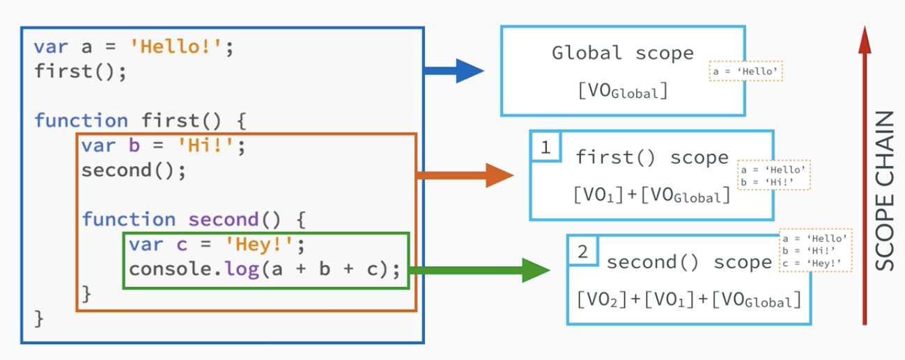
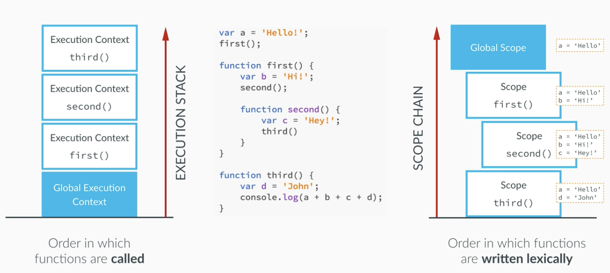

### 함수 테스트  

- calculate 함수를 선언하고,
- 임의의 인자를 전달하면, 현재의 연도에서 
    - 임의의 연도를 빼 값을 console 출력  
~~~
function calculateAge(year) {
    console.log(2016-year);
}

calculateAge(1990);
~~~    

 

- 현재연도에서 은퇴할 나이까지는 몇년 남았는지
    - 은퇴나이 65세 
    - 생년 1990년 
~~~
var retirement = function (year) {
    console.log(65-(2016-year)) ;
}

retirement(1990);
~~~

 
---

### scope 정리
~~~ 
var age = 23

function foo() {
    var age = 65;
    console.log(age);
}

foo();
console.log(age);
~~~

### scope chain
~~~
var a ='Hello!'
first();

function first() {
    var b = 'Hi!'
    second() ;

    function second() {
        var c ='Hey!' ;
        console.log(a+b+c);
    }
}

//결과 
Hello!Hi!Hey!
~~~

 

- scope chaing 2
~~~
var a ='Hello!'
first();

function first() {
    var b = 'Hi!'
    second() ;

    function second() {
        var c ='Hey!' ;
        third();
    }
}

function third() {
    var d = 'John' ;
    console.log(a + b+ c +d ) ; //a,d 만 출력 
}

//결과 
b is not defined
~~~

---

### this 키워드 
~~~
console.log(this);
~~~

- this 
~~~
function calculateAge(year) {
    console.log(2016 - year);
    console.log(this) ;
}
calculateAge(2000) ;
~~~

- this, 객체 
~~~
var john = {
    name : 'John',
    yearOfBirth : 2000,
    calculateAge : function () {
        console.log(this);
    }
}

john.calculateAge(); /객체 자신 
~~~

- calcualteAge : 
    - console.log(2017-this.yearOfBirth) 추가 
~~~
var john = {
    name : 'John',
    yearOfBirth : 2000,
    calculateAge : function () {
        console.log(this);
        console.log(2017- this.yearOfBirth);
    }
}
john.calculateAge();
~~~

- calculateAge : function 
    - innerFunction : function 추가 
~~~
var john = {
    name : 'John',
    yearOfBirth : 2000,
    calculateAge : function () {
        console.log(this);
        console.log(2017- this.yearOfBirth);

        function innerFunction() {
            console.log(this);
        }
        innerFunction();
    }
}
john.calculateAge();
~~~

- 객체의 메서드 할당 
~~~
var john = {
    name : 'John',
    yearOfBirth : 2000,
    calculateAge : function () {
        console.log(this);
        console.log(2017- this.yearOfBirth);

        // function innerFunction() {
        //     console.log(this);
        // }
        // innerFunction();
    }
}
john.calculateAge();

var mike = {
    name :'Mike',
    yearOfBirth : 1990
};

mike.calculateAge = john.calculateAge ;
mike.calculateAge();
~~~

### Scoping and the Scope Chain

### The 'this' keyword

### The 'this' Keyword in Practice 

---

### 타이머
- 2초 후 출력 
~~~
setTimeout( function(){ console.log("Hello"); }, 2000) ;
~~~

- 2초마다 출력  
~~~
setInterval( function(){ console.log("Hello"); }, 2000) ;
~~~

---
## 달력 만들기 
### Math 
- Math 
    - Math.random() 랜덤하게 가져옴 
    - Math.round(number) 반올림 
    - Math.ceil(number) 올림 
    - Math.floor(number) 버림 
~~~
function randomFunc(){
    var ran = Math.random() ;
    var round = Math.round( (ran*10)+1) ;
    var floor = Math.floor( (ran*10)+1) ;
    var ceil = Math.ceil( (ran*10)+1) ;

    console.log("random:"+ran+", round:"+round+", floor:"+floor+", ceil:"+ceil);
}
randomFunc();

//결과 
random:0.9448978899500236, round:10, floor:10, ceil:11
~~~

### Date()
- new Date()
    - new Date(년,월,일) (2008,2,1)
    - new Date(년,월,일,시,분,초) (2008,2,1,12,30,00)
- Date() 메소드 
    - getFullYear()
        - getYear() : 1900 을 기준 2017-1900 = 117 
    - getMonth() (0~11)
    - getDate() : 일 
    - getDay() : 요일 일:0,월:1
    - getTime()
    - getHours()
    - getMinutes()
    - getSeconds()   
- 설정일 경우 set이 앞에 존재                          
~~~
var today = new Date();
document.write("<h3>Document accessed on: "+today.toString());
~~~

- 오늘 날짜 시간 출력 
~~~
function getDay(day){
    var dayStr ;
    switch(day){
        case 0 :
            dayStr = "일" ;
            break ;
        case 1 :
            dayStr = "월" ;
            break ;
        case 2 :
            dayStr = "화" ;
            break ;
        case 3 :
            dayStr = "수" ;
            break ;
        case 4 :
            dayStr = "목" ;
            break ;
        case 5 :
            dayStr = "금" ;
            break ;
        case 6 :
            dayStr = "토" ;
            break ;
    }
    return dayStr
}

var today = new Date();
document.write("<h3>Document accessed on: "+today.toString());
document.write(" ") ;
document.write("오늘은 "+today.getFullYear()+"/"+(today.getMonth()+1)+"/"+today.getDate()) ;
document.write(" ") ;
document.write(getDay(today.getDay())+"요일") ;
document.write(" ") ;
document.write(today.getHours()+":"+today.getMinutes()+":"+today.getSeconds());

//결과 --- 
오늘은 2017/11/13
월요일
23:7:36
~~~

- \"오전/오후\" 시:분 으로 표시 
~~~
// 시간을 읽어와서 '오전/오후 시:분' 형태로 구해주는 함수
function getTime(){
    var now = new Date()
    var hour = now.getHours() ;
    var minute = now.getMinutes() ;
    var ampm ;

    if(hour >=12){
        hour -= 12 ;
        ampm ="오후" ;
    } else {
        ampm ="오전" ;
    }

    if(hour ==0) {
        hour = 12 ;
    }

    if(minute < 10){
        minute = "0"+minute ;
    }

    return ampm+" "+ hour+":"+minute ;
}
document.write(getTime());

//결과
오후 11:14
~~~
 
- 년월일의 마지막 날짜 
~~~
//년과 월을 받아서 마지막 일을 계산해주는 함수
function getDay(year, month){
    var lastMonth = new Array(31, 29, 31, 30, 31, 30, 31, 31, 30, 31, 30, 31) ;
    var mon2 ;
    //윤년 체크
    if(year % 4 ==0) {
        mon2 = true ;
    }
    if(year % 100 == 0) {
        mon2 = false ;
    }
    if(year % 400 == 0) {
        mon2 = true ;
    }

    if(mon2){
        lastMonth[1] = 29 ;
    } else {
        lastMonth[1] = 28 ;
    }

    return lastMonth[month] ;
}

document.write(getDay(2017,10)); //11월달 

//결과 
30 
~~~

- 달력 만들기 
    - Math 
        - Math.round(number) 반올림 
        - Math.ceil(number) 올림 
        - Math.floor(number) 버림 
 
~~~
//table 을 이용하여 달력을 만들어 줍니다
function drawCalendar(firstDay, lastDate, date, year, month){
    document.write("firstDay:"+firstDay+", lastDate:"+lastDate+", date:"+date+", year:"+year+",month:"+month);

    var text = "
" ;
        text +="    <table border=\'1\'>" ;

        text +="        <th colspan=7 bgcolor=#ffffcc>" ;
        text +="            "+year+"년 "+(month+1)+"월" ;
        text +="         </th>" ;

        text +="        <tr>" ;

        var weekDay = new Array("일","월","화","수","목","금","토") ; //나중에 text 위로 올림
        for (var dayNum=0 ; dayNum <=6 ; dayNum++){
            text += "<td width=\'45\' height=\'40\'>"+weekDay[dayNum]+"</td>";  //width, height 는 나중에
        }

        text +="        </tr>" ;

        var digit = 1 ;  //출력되는 날짜
        var curCell = 1 ; //처음시작할 때 빈공간

        //달력 표를 만들어 준다
        // lastDate(마지막날짜)+ firstDay(첫번째 날짜크기) - 1(처음에 더한것) / 7 (일주일 7요일) = 전체 몇주인지
        //console.log(Math.ceil((lastDate + firstDay -1 )/ 7)) ;
        for(var row = 1 ; row <= Math.ceil( (lastDate + firstDay -1 )/ 7 ) ; row++) {
            text += "<tr>" ;

            //1주일을 주기
            for(var col = 1 ; col <=7 ; col++){

                //마지막에 빈공간
                if(digit > lastDate){

                    //마지막 남은 공간의 갯수
                    // 총갯수 : (Math.ceil((lastDate + firstDay-1)/7))*7
                    // curCell(앞의 갯수) + lastDate(마지막날짜) - 1 (앞의 갯수에서 1개 빼기, curCell 이 1바퀴 더 돌기 때문 )
                    n = (Math.ceil((lastDate + firstDay-1)/7))*7 - (curCell + lastDate-1);

                    for(var i=1 ; i <= n ; i++){
                        text +="<td>&nbsp;</td>" ;
                    }
                    //마지막 날짜 뒤의 빈공간을 채우고 나면, 빠져나옴
                    break ;
                }

                //처음 시작할 때 빈공간, firstDay : 처음 시작요일 + 1
                if(curCell < firstDay){
                    text += "<td>&nbsp;</td>" ;
                    curCell++ ;
                }
                else {

                    if(digit == date){
                        text += "<td height=40>" ;
                        text += ""+digit+"" ;
                        text += " " ;
                        text += ""+getTime()+"" ;
                        text += "</td>" ;
                    } else {
                        text += "<td height=40>"+digit+"</td>" ;
                    }
                    digit++ ;
                }
            }

            text += "</tr>" ;

        }

        text +="    </table>" ;
        text += "
" ;

    return text ;
}

var now = new Date();
var year = now.getFullYear();
var month = now.getMonth();
var date = now.getDate() ; //날짜

var firstDayInstance = new Date(year, month,1) ;
//첫번째 날짜가 몇번째 칸에 존재하는지 확인, 1일의 요일확인후 + 1
var firstDay = firstDayInstance.getDay() + 1 ;

var days = getDay(year, month) ;
// document.write(year+"/"+month+"/"+date);
// document.write(" ") ;
// document.write("firstDay:"+firstDay);

my_calendar = drawCalendar(firstDay, days, date, year, month) ;

//최종적으로 그리기
document.write(my_calendar);
~~~

