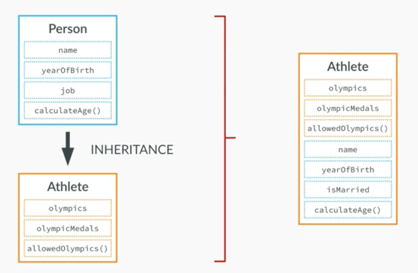
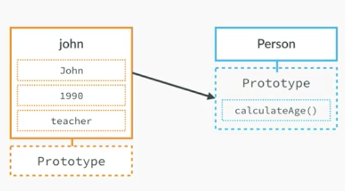
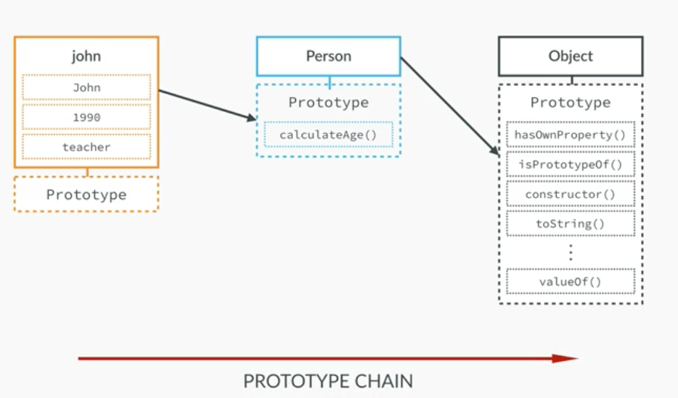

## Form
- css 링크  
~~~
<link rel="stylesheet" type="text/css" href="./css/form.css">
~~~

- form 
~~~
<form method="POST" action="javascript:check()" name="frm">
~~~
- 기본 아이템
    - form.css 
~~~
.div_height {
    margin-top: 10px;
}
~~~
~~~
<body>

    <form method="POST" action="javascript:check()" name="frm">
        

            가입신청서에 *란은 필수 입니다
        

        

            <input type="text"  name="name" placeholder="name">*
        

        

            <input type="text"  name="id" placeholder="ID">*
        

        

            <input type="password" name="password1" placeholder="비밀번호1">*
        

        

            <input type="password" name="password2" placeholder="비밀번호2">*
        

        

            <select name="job">
                <option selected>--직업명--</option>
                <option value="worker">회사원</option>
                <option value="officer">공무원</option>
                <option value="student">학생</option>
                <option value="solider">군인</option>

            </select>
        

        

            <input type="radio" name="gender" value="man">남
            <input type="radio" name="gender" value="woman">여
        

        

            <input type="checkbox" name="hobby" value="reading">독서
            <input type="checkbox" name="hobby" value="hiking">등산
            <input type="checkbox" name="hobby" value="fishing">낚시
        

        

            <textarea name="content" rows="5" cols="30"></textarea>
        

        

            <input type="submit" value="가입">
            <input type="reset" value="취">
        

    </form>

</body>
~~~

- form.html
~~~

~~~
- form.js 
~~~
function ready() {
    document.frm.name.focus();
}
~~~
~~~
<body onload="ready()">
~~~

 

- form , javascript:check()
~~~
<form method="POST" action="javascript:check()" name="frm">
~~~

- form.html
~~~

    <form method="POST" action="javascript:check()" name="frm">
        

            가입신청서에 *란은 필수 입니다
        

        

            <input type="text"  name="name" placeholder="name">*
        

        

            <input type="text"  name="id" placeholder="ID">*
        

        

            <input type="password" name="password1" placeholder="비밀번호1">*
        

        

            <input type="password" name="password2" placeholder="비밀번호2">*
        

        

            <select name="job">
                <option selected>--직업명--</option>
                <option value="worker">회사원</option>
                <option value="officer">공무원</option>
                <option value="student">학생</option>
                <option value="solider">군인</option>

            </select>
        

        

            <input type="radio" name="gender" value="man">남
            <input type="radio" name="gender" value="woman">여
        

        

            <input type="checkbox" name="hobby" value="reading">독서
            <input type="checkbox" name="hobby" value="hiking">등산
            <input type="checkbox" name="hobby" value="fishing">낚시
        

        

            <textarea name="content" rows="5" cols="30"></textarea>
        

        

            <input type="submit" value="가입">
            <input type="reset" value="취소">
        

    </form>

~~~

- form.js
~~~
function check() {
    if(document.frm.name.value ==""){
        alert("이름을 입력해주세요");
        document.frm.name.focus() ;
        return ;
    }
    if(document.frm.id.value ==""){
        alert("아이디를 입력해주세요");
        document.frm.id.focus() ;
        return ;
    }
    if(document.frm.password1.value ==""){
        alert("비밀번호를 입력해주세요");
        document.frm.password1.focus();
        return ;
    }
    if(document.frm.password2.value == ""){
        alert("비밀번호 확인");
        document.frm.password2.focus();
        return ;
    }
    if(document.frm.password1.value != document.frm.password2.value){
        alert("비밀번호가 다릅니다");
        document.frm.password2.focus()
        return ;
    }

    if(document.frm.job.selectedIndex ==0){
        alert("직업을 선택하세요");
        document.frm.job.focus();
        return ;
    }
    if(document.frm.gender[0].checked == false && document.frm.gender[1].checked == false){
        alert("성별을 선택하세요");
        return ;
    }
    alert('입력된 데이터를 서버로 전송합니다');
    document.frm.action="" ;
    document.frm.submit();
}
~~~

---
## Primitive vs Objects

- constructor 
    - instance 
    

- 상속 

- prototype 

----

- index.js 개별 객체 만들기 
~~~
var john = {
    name: 'John',
    yearOfBirth : 1998,
    job : 'teacher'
};
~~~

- function constructor 함수 생성자 만들기 
~~~
var Person = function (name,yearOfBirth, job) {
    this.name = name ;
    this.yearOfBirth = yearOfBirth ;
    this.job = job ;
}
~~~

- 인스턴스 생성 
~~~
var john = new Person('John',1990, 'teacher');
~~~

- this.calculateAge = function () { 추가 
~~~
var Person = function (name,yearOfBirth, job) {
    this.name = name ;
    this.yearOfBirth = yearOfBirth ;
    this.job = job ;
    this.calculateAge = function () {
        console.log(2016-this.yearOfBirth);
    }
}
~~~

- john.calculateAge() ;
    - this.calculateAge 추가 이후 
~~~
var john = new Person('John',1990, 'teacher');
john.calculateAge() ;
~~~

- var jane, var mark 추가 
~~~
var john = new Person('John',1990, 'teacher');
john.calculateAge() ;

var jane = new Person('Jane',1969, 'designer');
var mark = new Person('Mark',1948, 'retired') ;
~~~

- var Person 에서 this.calculateAge 를 없애고
    - Person.prototype에 calucalteAge 을 입력 
~~~
var Person = function (name,yearOfBirth, job) {
    this.name = name ;
    this.yearOfBirth = yearOfBirth ;
    this.job = job ;
}

Person.prototype.calculateAge = function () {
    console.log(2017-this.yearOfBirth);
}
~~~

- 그리고 각각의 프로토타입 함수를 인스턴스를 통해서 출력해본다 
    - console 로 확인 
~~~
var john = new Person('John',1990, 'teacher');
var jane = new Person('Jane',1969, 'designer');
var mark = new Person('Mark',1948, 'retired') ;

john.calculateAge() ; // 27
jane.calculateAge() ; // 48
mark.calculateAge() ; // 69
~~~

- Person.prototype.lastName = 'Smith' ; 추가  
~~~
Person.prototype.calculateAge = function () {
    console.log(2017-this.yearOfBirth);
}

Person.prototype.lastName = 'Smith' ;
~~~

- Person.prototype.lastName 을 console 출력해보기 
~~~
john.calculateAge() ;
jane.calculateAge() ;
mark.calculateAge() ;

console.log(john.lastName);
console.log(jane.lastName) ;
console.log(mark.lastName) ;
~~~

- console 에서 john 를 실행시키면 
    - Person 인스턴스 정보 확인 가능 
- console 에서 
    - Person.prototype 실행시키면
        - 다양한 정보 확인 가능  
- console 에서 
    - john.__proto__ === Person.prototype
        - 결과 : true 
- console 에서 
    - john.hasOwnProperty('job')
        - 결과 : true  
- console에서 
    - john.hasOwnProperty('lastName')
        - 결과 : false 
- console 에서 
    - john instanceof Person 
        - 결과 : true    
        
---

 

- console 에서 
    - 배열 선언 
~~~
var x = [ 2, 4, 6]
~~~

- console 에서 
    - x 타이핑하면 배열 결과 나옴 
- console 에서 
    - 정보 확인 
~~~
console.info(x)
~~~   
~~~
x.length
~~~

 

---

### Object create 
- john 객체 생성 
~~~
var personProto = {
    calculateAge : function () {
        console.log(2017- this.yearOfBirth);
    }
}

var john = Object.create(personProto);
~~~ 
- console 에서 john 타이핑 
~~~
john
~~~

- john 객체의 속성 추가 
~~~
var john = Object.create(personProto);
john.name = 'John' ;
john.yearOfBirth = 1990 ;
john.job ='teacher' ;
~~~

- 다른 방법으로 jane 객체 생성 
~~~
var jane = Object.create(personProto, {
    name : {value :'Jane'},
    yearOfBirth : { value : 1969},
    job : { value : 'designer'}
});
~~~

 

---

## Primitives VS Objects 

- 숫자 (Primitive)
~~~
var a = 23 ;
var b = a ;
a = 46 ;
console.log(a) ; //46
console.log(b) ; //23 다름 
~~~

- object
~~~
var obj2 = obj1 ;  //같은 메모리 
obj1.age = 30 ;
console.log(obj1.age) ; // 30
console.log(obj2.age) ; // 30 같음 
~~~

- functions 
~~~
//Functions 
var age = 27 ;
var obj = {
    name : 'Jonas',
    city : 'Lisbon'
};

function change(a,b) {
    a = 30 ;
    b.city = 'San Francisco';
}

change(age, obj) ;

console.log(age);  // 27
console.log(obj.city) ;  // San Francisco
~~~