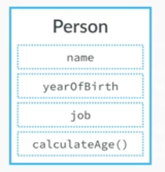
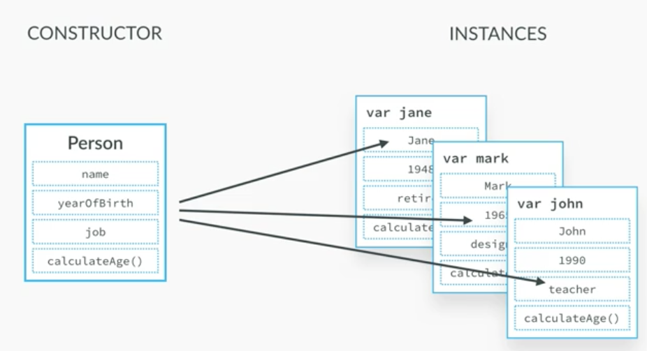
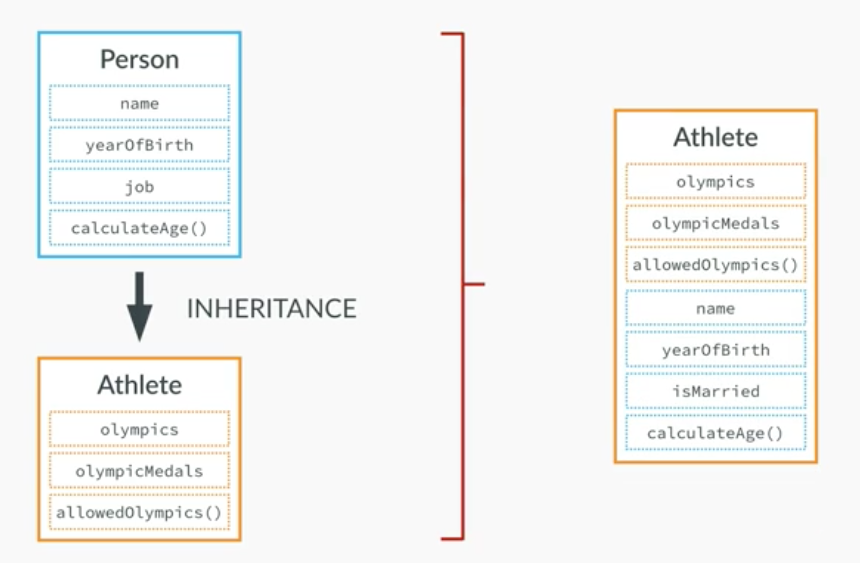
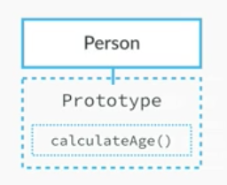
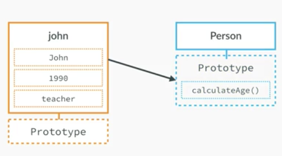
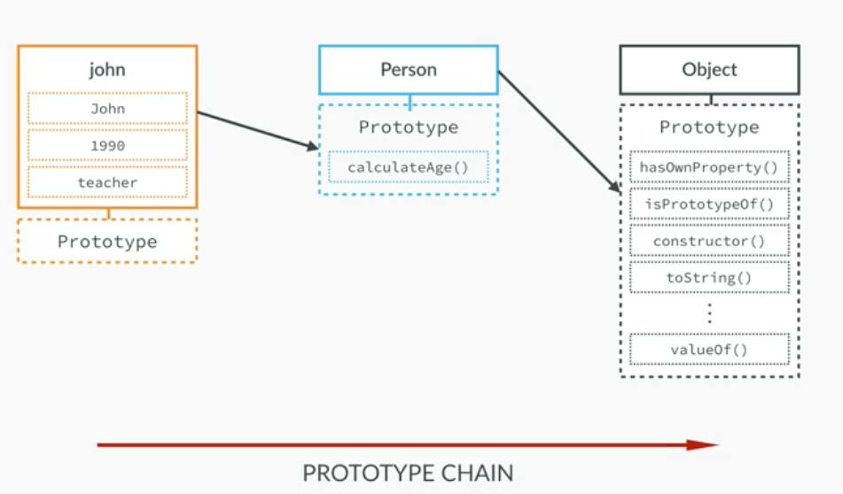

     
---
## Primitive vs Objects

- constructor 
    - instance 
    

- 상속 

- prototype 

----

- index.js 개별 객체 만들기 
~~~
var john = {
    name: 'John',
    yearOfBirth : 1998,
    job : 'teacher'
};
~~~

- function constructor 함수 생성자 만들기 
~~~
var Person = function (name,yearOfBirth, job) {
    this.name = name ;
    this.yearOfBirth = yearOfBirth ;
    this.job = job ;
}
~~~

- 인스턴스 생성 
~~~
var john = new Person('John',1990, 'teacher');
~~~

- this.calculateAge = function () { 추가 
~~~
var Person = function (name,yearOfBirth, job) {
    this.name = name ;
    this.yearOfBirth = yearOfBirth ;
    this.job = job ;
    this.calculateAge = function () {
        console.log(2016-this.yearOfBirth);
    }
}
~~~

- john.calculateAge() ;
    - this.calculateAge 추가 이후 
~~~
var john = new Person('John',1990, 'teacher');
john.calculateAge() ;
~~~

- var jane, var mark 추가 
~~~
var john = new Person('John',1990, 'teacher');
john.calculateAge() ;

var jane = new Person('Jane',1969, 'designer');
var mark = new Person('Mark',1948, 'retired') ;
~~~

- var Person 에서 this.calculateAge 를 없애고
    - Person.prototype에 calucalteAge 을 입력 
~~~
var Person = function (name,yearOfBirth, job) {
    this.name = name ;
    this.yearOfBirth = yearOfBirth ;
    this.job = job ;
}

Person.prototype.calculateAge = function () {
    console.log(2017-this.yearOfBirth);
}
~~~

- 그리고 각각의 프로토타입 함수를 인스턴스를 통해서 출력해본다 
    - console 로 확인 
~~~
var john = new Person('John',1990, 'teacher');
var jane = new Person('Jane',1969, 'designer');
var mark = new Person('Mark',1948, 'retired') ;

john.calculateAge() ; // 27
jane.calculateAge() ; // 48
mark.calculateAge() ; // 69
~~~

- Person.prototype.lastName = 'Smith' ; 추가  
~~~
Person.prototype.calculateAge = function () {
    console.log(2017-this.yearOfBirth);
}

Person.prototype.lastName = 'Smith' ;
~~~

- Person.prototype.lastName 을 console 출력해보기 
~~~
john.calculateAge() ;
jane.calculateAge() ;
mark.calculateAge() ;

console.log(john.lastName);
console.log(jane.lastName) ;
console.log(mark.lastName) ;
~~~

- console 에서 john 를 실행시키면 
    - Person 인스턴스 정보 확인 가능 
- console 에서 
    - Person.prototype 실행시키면
        - 다양한 정보 확인 가능  
- console 에서 
    - john.__proto__ === Person.prototype
        - 결과 : true 
- console 에서 
    - john.hasOwnProperty('job')
        - 결과 : true  
- console에서 
    - john.hasOwnProperty('lastName')
        - 결과 : false 
- console 에서 
    - john instanceof Person 
        - 결과 : true    
        
---

 

- console 에서 
    - 배열 선언 
~~~
var x = [ 2, 4, 6]
~~~

- console 에서 
    - x 타이핑하면 배열 결과 나옴 
- console 에서 
    - 정보 확인 
~~~
console.info(x)
~~~   
~~~
x.length
~~~

 

---

### Object create 
- john 객체 생성 
~~~
var personProto = {
    calculateAge : function () {
        console.log(2017- this.yearOfBirth);
    }
}

var john = Object.create(personProto);
~~~ 
- console 에서 john 타이핑 
~~~
john
~~~

- john 객체의 속성 추가 
~~~
var john = Object.create(personProto);
john.name = 'John' ;
john.yearOfBirth = 1990 ;
john.job ='teacher' ;
~~~

- 다른 방법으로 jane 객체 생성 
~~~
var jane = Object.create(personProto, {
    name : {value :'Jane'},
    yearOfBirth : { value : 1969},
    job : { value : 'designer'}
});
~~~

 

---

## Primitives VS Objects 

- 숫자 (Primitive)
~~~
var a = 23 ;
var b = a ;
a = 46 ;
console.log(a) ; //46
console.log(b) ; //23 다름 
~~~

- object
~~~
var obj2 = obj1 ;  //같은 메모리 
obj1.age = 30 ;
console.log(obj1.age) ; // 30
console.log(obj2.age) ; // 30 같음 
~~~

- functions 
~~~
//Functions 
var age = 27 ;
var obj = {
    name : 'Jonas',
    city : 'Lisbon'
};

function change(a,b) {
    a = 30 ;
    b.city = 'San Francisco';
}

change(age, obj) ;

console.log(age);  // 27
console.log(obj.city) ;  // San Francisco
~~~

 

----

## 함수를 전달해서 계산하기  

~~~js
var yearsArr = [1990, 1965, 1937, 2005, 1998] ;

function arrayCalc(arr, fn) {
    var resultArr = [] ;
    for(var i=0 ; i < arr.length ; i++){
        resultArr.push(  fn(arr[i]) )
    }

    return resultArr ;
}
~~~

- 전달할 함수 선언 
~~~js
function calculateAge(year) {
    return 2017 - year ;
}
~~~

- 실행하기 
    - 결과는 각각의 값을 뺀 배열리스트 
~~~js
function calculateAge(year) {
    return 2017 - year ;
}

var ages = arrayCalc(yearsArr, calculateAge) ;
console.log(ages)
~~~

- function isFullAge(age)  함수 추가 
    - function calculateAge(year)  아래에 
~~~js
function isFullAge(age) {
    return age >= 18 ;
}
~~~

- 실행 추가 var fullAges = arrayCalc(ages, isFullAge);
    - var ages = arrayCalc(yearsArr, calculateAge) ; 아래에 
~~~
var fullAges = arrayCalc(ages, isFullAge);
console.log(fullAges)
~~~    

 

---

### 함수를 리턴하기 
~~~
function interViewQuestion(job) {
    if(job ==="designer"){
        return function (name) {
            console.log(name + ', 어떠한 종류의 UX 디자이너입니까?');
        }

    } else if(job === "teacher") {
        return function (name) {
            console.log(name + ", 무슨 과목을 가르치십니까?") ;
        }

    } else {
        return function (name) {
            console.log(name+', 무슨 일을 하십니까?') ;
        }
    }
}

~~~
~~~
var teacherQuestion = interViewQuestion('teacher') ;
teacherQuestion('John'); //John, 무슨 과목을 가르치십니까?

var designerQuestion = interViewQuestion('designer') ;
designerQuestion('Jane') ;  // Jane, 어떠한 종류의 UX 디자이너입니까?
designerQuestion('John') ;  // John, 어떠한 종류의 UX 디자이너입니까?

var programmerQuestion = interViewQuestion('programmer');
programmerQuestion('Peter') ;  // Peter, 무슨 일을 하십니까?
~~~

- 한번에 직업, 이름 입력하기 
~~~
interViewQuestion('teacher')('Mark') ;  //Mark, 무슨 과목을 가르치십니까?
~~~

 

---
## 함수 선언 및 실행 한번에 

- 함수 선언 및 실행과정 
~~~
function game() {
    var score = Math.random() * 10 ;
    console.log( score >=5 ) ;
}
game() ;
~~~

- 선언 및 실행을 한꺼번에 하기 
~~~
(function () {
    var score = Math.random() * 10 ;
    console.log( score >=5 ) ;
})();
~~~

- 인자 전달하기 
~~~
(function (goodLuck) {
    var score = Math.random() * 10 ;
    console.log("score="+score) ;
    console.log( score >= ( 5 - goodLuck)  ) ;
})(2);
~~~

 

---

## call, apply 

~~~
var john = {
    name : 'John',
    age : 26,
    job: 'teacher',
    presentation : function (style, timeOfDay) {
        if(style === 'formal'){
            console.log('Good '+timeOfDay+' , 저의 이름은 '+this.name+ ', 직업은 '+this.job+', 나이는 '+this.age+ ' 입니다');

        } else if(style === 'friendly'){
            console.log('Good '+timeOfDay+' What\'s up, 저의 이름은 '+this.name+ ', 직업은 '+this.job+', 나이는 '+this.age+' 입니다');
        }
    }
}

var emily = {
    name :'Emily',
    age : 20,
    job : 'designer'
}

john.presentation('formal','morning');
//결과 : Good morning , 저의 이름은 John, 직업은 teacher, 나이는 26 입니다
~~~
- call, 
- apply : 파라미터를 배열로 받음 
~~~
john.presentation.call(emily, 'friendly','afternoon' ) ;
// 결과 : Good afternoon What's up, 저의 이름은 Emily, 직업은 designer, 나이는 20 입니다

john.presentation.apply(emily, ['friendly','afternoon'] ) ;
// 결과 : Good afternoon What's up, 저의 이름은 Emily, 직업은 designer, 나이는 20 입니다
~~~
- bind
~~~
var johnFriendly = john.presentation.bind(john, 'friendly') ;

johnFriendly('morning'); 
// 결과 : Good morning What's up, 저의 이름은 John, 직업은 teacher, 나이는 26 입니다

johnFriendly('night'); 
// 결과 : Good night What's up, 저의 이름은 John, 직업은 teacher, 나이는 26 입니다
~~~

~~~
var emilyFormal = john.presentation.bind(emily, 'formal') ;
emilyFormal('afternoon') ;
// 결과 : Good afternoon , 저의 이름은 Emily, 직업은 designer, 나이는 20 입니다
~~~

- bind 연결 예제 
~~~
var yearsArr = [1990, 1965, 1937, 2005, 1998] ;

function arrayCalc(arr, fn) {
    var resultArr = [] ;
    for(var i=0 ; i < arr.length ; i++){
        resultArr.push(  fn(arr[i]) )
    }

    return resultArr ;
}

function calculateAge(year) {
    return 2017 - year ;
}

function isFullAge(limit, age) {
    return age >= limit ;
}

var ages = arrayCalc(yearsArr, calculateAge) ;
console.log(ages);  // [27, 52, 80, 12, 19]

var fullChina = arrayCalc(ages, isFullAge.bind(this, 20));
console.log(fullChina);  // [true, true, true, false, false]
~~~
     

 
